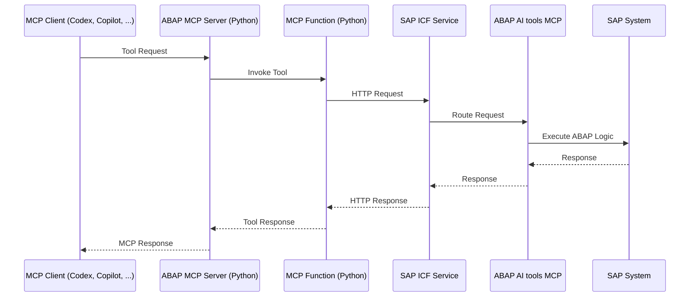
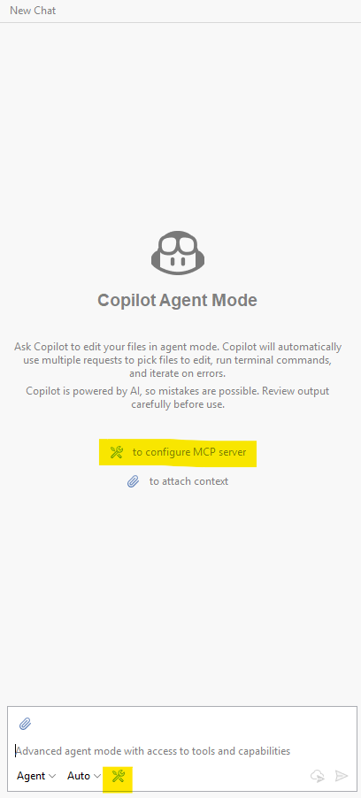
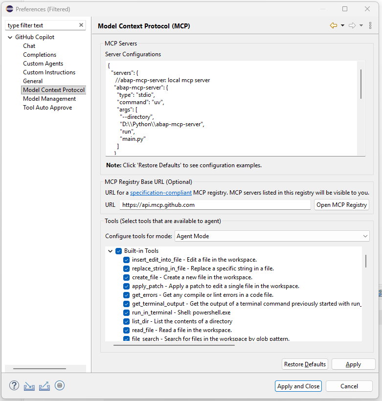
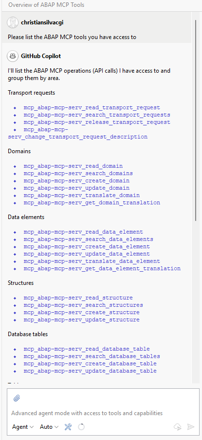
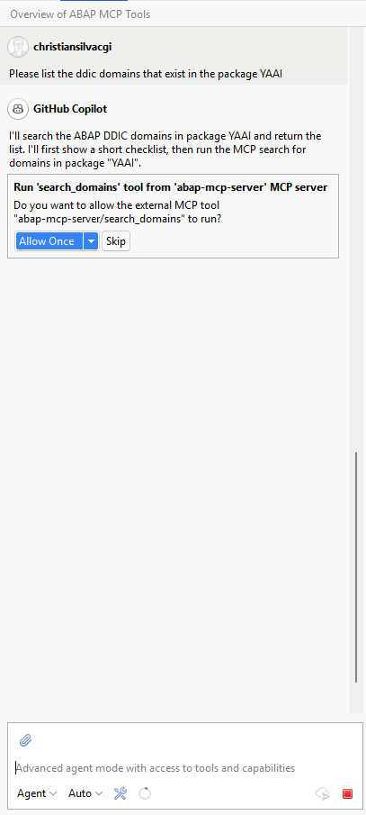
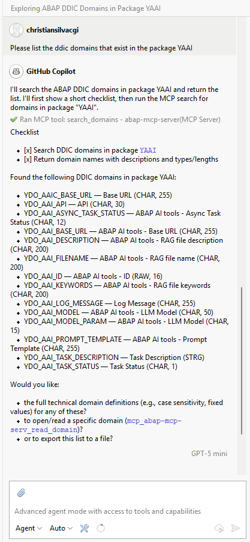

# abap-mcp-server
ABAP AI tools - ABAP MCP Server

This repository contains a lightweight MCP server written in Python. It exposes the ABAP MCP tools from the ABAP AI tools so they can be used through an MCP-compatible client.

## Architecture



## Available Tools

### ABAP Dictionary (DDIC) Management

- **Domains**
  - Read, search, create, update domains
  - Manage translations for domain fixed values

- **Data Elements**
  - Read, search, create, update data elements with built-in types or domain references
  - Manage translations for data element labels

- **Structures**
  - Read, search, create, update structures

- **Tables**
  - Read, search, create, update transparent tables

- **Table Types**
  - Read, search, create, update table types

- **CDS views**
  - Read, search, create, update, delete CDS views

### SQL Tools

- **SQL**
  - Perform SELECT, INSERT, UPDATE and DELETE statements on the SAP system

### ABAP Coding

- **ABAP Class**
  - Read, search, create, update, check, activate ABAP Classes

- **ABAP Interface**
  - Read, search, create, update, check, activate ABAP Interfaces

- **ABAP Function Group**
  - Read, search, create, update, check, activate ABAP function groups

- **ABAP Function Module**
  - Read, search, create, update, check, activate ABAP function modules

- **ABAP Program and Include** 
  - Read, search, create, update, check, activate ABAP programs and includes

### Transport Management

- **Transport Requests**
  - Create workbench and customizing requests
  - Search and read transport request details
  - Release transport requests

### Messages and Message Classes

- **Message Classes**
  - Read, create, update message classes

- **Messages**
  - Read, create, update, translate, delete messages

## Installation

### Prerequisites

The ABAP system must have the following packages installed:

 - **[ABAP AI tools](https://github.com/christianjianelli/yaai)**
 - **[ABAP AI tools - Function Calling](https://github.com/christianjianelli/yaai_fc)**
 - **[ABAP AI tools - MCP tools](https://github.com/christianjianelli/yaai_mcp)**

You also need a working Python environment that can install the packages from `requirements.txt`.

### Installation Steps

1. Clone the repository:

```bash
git clone https://github.com/christianjianelli/yaai_mcp.git
cd abap-mcp-server
```

2. Create and activate a virtual environment:

```bash
python -m venv .venv
```

On Windows:

```bash
.venv\Scripts\activate
```

On macOS/Linux:

```bash
source .venv/bin/activate
```

3. Install the Python dependencies:

```bash
pip install -r requirements.txt
```

4. Create a `.env` file in the project root and configure the connection to your ABAP backend:

```env
BASE_URL=https://vhcalnplci.dummy.nodomain:44300/sap/yaai/
SAP_USERNAME=<your-username>
SAP_PASSWORD=<your-password>
```

`BASE_URL` is used as the prefix for the individual MCP tool endpoints. Update the host (https://vhcalnplci.dummy.nodomain) and port (44300) to match your ABAP server.

5. Set up your local MCP server in Github Copilot in Eclipse

>>> Note: The server runs over stdio, so it is meant to be launched by the MCP client.

Click on the Configure Tools button in the Copilot chat window or the click on the Copilot menu -> Edit Preferences -> find the MCP Servers section.

<p>
  
</p>

Edit the MCP server JSON file as shown in the example below. Change the directory path in the args array to the folder on your computer where `main.py` file is located.

 ```json
{
  "servers": {
    "abap-mcp-server": {
      "type": "stdio",
      "command": "uv",
      "args": [
        "--directory",
        "D:\\Python\\abap-mcp-server",
        "run",
        "main.py"
      ]
    }
  }
}
 ```

<p>
  
</p>

After completing the configuration, ask Copilot to list the tools it has access to

<p>
  
</p>

or ask Copilot to use one of the tools

<p>
  
</p>

<p>
  
</p>

